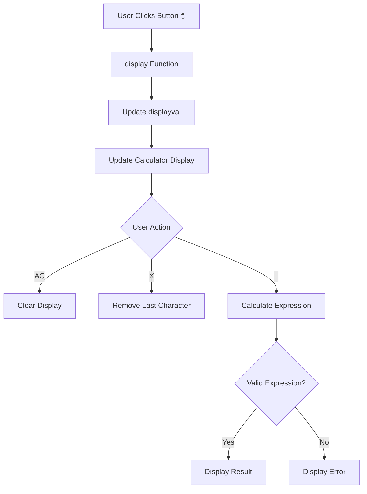

# 🧮 JavaScript Calculator — Simple Arithmetic Calculator

⚡ **JavaScript Calculator** is a simple and interactive calculator application built using **HTML5, CSS3, and JavaScript**.  
It performs basic arithmetic operations and demonstrates fundamental JavaScript concepts such as **functions, DOM manipulation, event handling, string manipulation, and error handling**. 🔢

<p align="center">


</p>

---

## 🚀 Technologies Used

<table>
<tr>
<td align="center">
<br>
HTML5
</td>

<td align="center">
<br>
CSS3
</td>

<td align="center">
<br>
JavaScript
</td>
</tr>
</table>

---


## ⚙️ Key Features

| Feature | Description |
| ------- | ----------- |
| ➕ **Addition** | Performs addition of numbers |
| ➖ **Subtraction** | Performs subtraction of numbers |
| ✖️ **Multiplication** | Performs multiplication of numbers |
| ➗ **Division** | Performs division of numbers |
| % **Percentage** | Supports percentage calculations |
| 🔢 **Decimal Numbers** | Supports decimal values |
| 🧹 **Clear** | Clears the complete calculation |
| ❌ **Delete** | Removes the last entered character |
| ⚠️ **Error Handling** | Displays an error for invalid expressions |
| 🖥️ **Interactive UI** | Responds to user button clicks |

---

## 🧠 JavaScript Concepts Practiced

This project helped me practice the following JavaScript concepts:

- Variables using `let`
- Functions and parameters
- DOM manipulation using `getElementById()`
- Event handling using `onclick`
- String concatenation
- String manipulation using `slice()`
- Expression evaluation using `eval()`
- Error handling using `try...catch`
- Updating HTML input values dynamically

---

## 📁 Project Structure

```text
javascript-calculator/
│
├── index.html
├── style.css
├── index.js
└── README.md
```

---

## 🔁 How It Works



---

## 💻 Main JavaScript Functions

### `display()`

Adds the selected number or operator to the calculator display.

```javascript
function display(input) {
    displayval += input;
    c.value = displayval;
}
```

### `cleardis()`

Clears the calculator display.

```javascript
function cleardis() {
    displayval = "";
    c.value = displayval;
}
```

### `remove()`

Removes the last entered character using `slice()`.

```javascript
function remove() {
    displayval = displayval.slice(0, displayval.length - 1);
    c.value = displayval;
}
```

### `calci()`

Evaluates the entered expression and handles errors using `try...catch`.

```javascript
function calci() {
    try {
        displayval = eval(displayval);
        c.value = String(displayval);
    }
    catch (error) {
        c.value = "Error";
        displayval = "";
    }
}
```

---

## 🚀 How to Run

### 1. Clone the Repository

```bash
git clone <your-github-repository-url>
```

### 2. Open the Project

```bash
cd javascript-calculator
```

### 3. Run the Application

Open `index.html` directly in your browser.

You can also use **Live Server** in VS Code for a better development experience.

---

## 🎯 Project Purpose

This project was created as part of my **JavaScript learning journey**.

The main goal was to understand how JavaScript interacts with HTML elements, handles user events, updates the DOM, and performs calculations.

I am continuing to build small JavaScript projects to strengthen my **programming and frontend development fundamentals**.

---

## 📸 Project Preview

Add a screenshot of your calculator here:

```markdown

```

---

## 🔮 Future Improvements

- Add keyboard support
- Improve responsive design
- Add calculation history
- Add dark/light mode
- Replace `eval()` with a safer expression parser

---

## 🤝 Contributing

Suggestions and improvements are welcome!

1. Fork the repository
2. Create a new branch
3. Make your changes
4. Commit and push your changes
5. Open a Pull Request 🚀

---

## 📜 License

This project is created for **learning and portfolio purposes**.

---

## 🔗 Connect With Me

<p align="left">
  <a href="https://github.com/VarshaChintapatla" target="_blank">
    
  </a>

  <a href="https://www.linkedin.com/in/varsha-chintapatla-391428332/" target="_blank">
    
  </a>
</p>

---

<h3 align="center">
  <em>Made with ❤️ by <strong>Chintapatla Varsha</strong></em>
</h3>