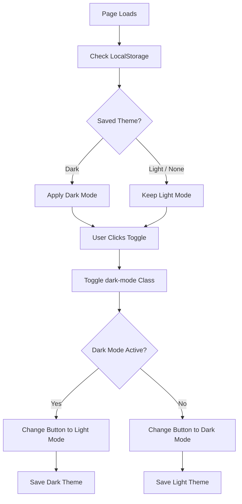

# 🌙 Dark/Light Mode Toggle — Theme Switcher

⚡ **Dark/Light Mode Toggle** is a simple and interactive theme-switching application built using **HTML5, CSS3, and JavaScript**.

The application allows users to switch between **Light Mode and Dark Mode** with a button click. It also uses **LocalStorage** to remember the user's selected theme even after refreshing or reopening the page.

This project demonstrates fundamental JavaScript concepts such as **DOM manipulation, event handling, conditional statements, CSS class manipulation, and LocalStorage**. 🌙☀️

<p align="center">


</p>

---

## 🚀 Technologies Used

<table>
<tr>
<td align="center">
<br>
HTML5
</td>

<td align="center">
<br>
CSS3
</td>

<td align="center">
<br>
JavaScript
</td>
</tr>
</table>

---

## ⚙️ Key Features

| Feature | Description |
| ------- | ----------- |
| 🌙 **Dark Mode** | Switches the page to a dark theme |
| ☀️ **Light Mode** | Switches the page back to the light theme |
| 🖱️ **Toggle Button** | Changes the theme when the user clicks the button |
| 💾 **Theme Persistence** | Saves the selected theme using LocalStorage |
| 🔄 **Refresh Support** | Maintains the selected theme after refreshing the page |
| 🎨 **Dynamic UI** | Updates the button text and theme dynamically |
| ⚡ **Interactive Interface** | Responds to user actions using JavaScript |

---

## 🧠 JavaScript Concepts Practiced

This project helped me practice the following JavaScript concepts:

- Variables using `const`
- DOM manipulation using `getElementById()`
- Event handling using `addEventListener()`
- Functions
- Conditional statements using `if...else`
- CSS class manipulation using `classList.toggle()`
- Checking classes using `classList.contains()`
- Updating HTML content using `textContent`
- Browser storage using `localStorage.setItem()`
- Retrieving stored data using `localStorage.getItem()`
- Working with user interactions
- Connecting JavaScript with HTML and CSS

---

## 📁 Project Structure

```text
Dark-toggle/
│
├── index.html
├── style.css
├── script.js
└── README.md
```

---

## 🔁 How It Works



---

## 💻 Main JavaScript Functions

### `getElementById()`

Selects the toggle button from the HTML.

```javascript
const toggleBtn = document.getElementById("toggleBtn");
```

---

### `addEventListener()`

Detects when the user clicks the toggle button.

```javascript
toggleBtn.addEventListener("click", function () {
    // Theme switching logic
});
```

---

### `classList.toggle()`

Adds or removes the `dark-mode` class from the body.

```javascript
document.body.classList.toggle("dark-mode");
```

If the class is not present, it is added.

If the class is already present, it is removed.

---

### `classList.contains()`

Checks whether Dark Mode is currently active.

```javascript
if (document.body.classList.contains("dark-mode")) {
    // Dark Mode is active
}
```

---

### `localStorage.setItem()`

Saves the selected theme in the browser.

```javascript
localStorage.setItem("theme", "dark");
```

The browser stores this value so that the theme can be restored later.

---

### `localStorage.getItem()`

Retrieves the saved theme when the page loads.

```javascript
const savedTheme = localStorage.getItem("theme");
```

This allows the application to remember the user's previous choice.

---

## 🧩 Core JavaScript Logic

```javascript
const toggleBtn = document.getElementById("toggleBtn");

const savedTheme = localStorage.getItem("theme");

if (savedTheme === "dark") {
    document.body.classList.add("dark-mode");
    toggleBtn.textContent = "☀️ Light Mode";
}

toggleBtn.addEventListener("click", function () {

    document.body.classList.toggle("dark-mode");

    if (document.body.classList.contains("dark-mode")) {

        toggleBtn.textContent = "☀️ Light Mode";
        localStorage.setItem("theme", "dark");

    } else {

        toggleBtn.textContent = "🌙 Dark Mode";
        localStorage.setItem("theme", "light");
    }
});
```

---

## 🚀 How to Run

### 1. Clone the Repository

```bash
git clone <your-github-repository-url>
```

### 2. Open the Project

```bash
cd Dark-toggle
```

### 3. Run the Application

Open `index.html` directly in your browser.

You can also use **Live Server** in VS Code for a better development experience.

---

## 🎯 Project Purpose

This project was created as part of my **JavaScript learning journey**.

The main goal was to understand how JavaScript can interact with HTML elements, respond to user events, dynamically change CSS classes, and store information in the browser using **LocalStorage**.

Building this project helped me understand how a simple feature such as a theme toggle can combine multiple JavaScript concepts into an interactive web application.

I am continuing to build small JavaScript projects to strengthen my **programming and frontend development fundamentals**.

---

## 📸 Project Preview

Add a screenshot of your Dark/Light Mode Toggle here:

```markdown

```

---

## 🔮 Future Improvements

- Add smooth theme transition animations
- Add system theme detection
- Add multiple color themes
- Improve responsive design
- Add a theme icon animation
- Store additional user preferences
- Add a system default theme option

---

## 🤝 Contributing

Suggestions and improvements are welcome!

1. Fork the repository
2. Create a new branch
3. Make your changes
4. Commit and push your changes
5. Open a Pull Request 🚀

---

## 📜 License

This project is created for **learning and portfolio purposes**.

---

## 🔗 Connect With Me

<p align="left">
  <a href="https://github.com/VarshaChintapatla" target="_blank">
    
  </a>

  <a href="https://www.linkedin.com/in/varsha-chintapatla-391428332/" target="_blank">
    
  </a>
</p>

---

<h3 align="center">
  <em>Made with ❤️ by <strong>Chintapatla Varsha</strong></em>
</h3>