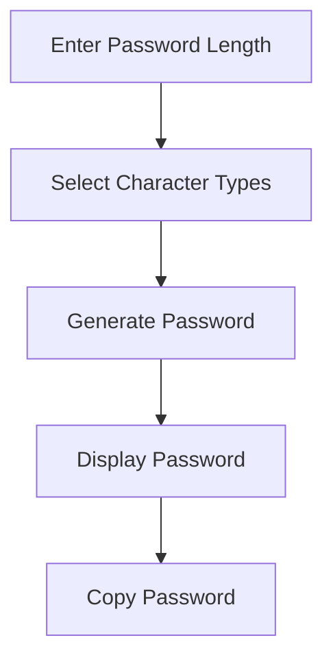

# 🔐 Password Generator

⚡ **Password Generator** is a simple and interactive application built using **HTML5, CSS3, and JavaScript**.

It generates random passwords using uppercase letters, lowercase letters, numbers, and special characters. Users can customize the password length and copy the generated password with a button click.

This project demonstrates JavaScript fundamentals such as **arrays, strings, randomization, loops, functions, DOM manipulation, and event handling**.

<p align="center">
  
  
  
</p>

---

## 🚀 Technologies Used

- HTML5
- CSS3
- JavaScript

---

## ⚙️ Key Features

- 🔐 Random password generation
- 🔠 Uppercase and lowercase letters
- 🔢 Numbers and special characters
- 📏 Customizable password length
- 📋 Copy password to clipboard
- 🎨 Interactive user interface

---

## 🧠 JavaScript Concepts Practiced

- Arrays and Strings
- `Math.random()` and `Math.floor()`
- Loops and Functions
- DOM Manipulation
- Event Handling using `addEventListener()`
- Conditional Statements
- Clipboard API

---

## 📁 Project Structure

```text
Password-Generator/
├── index.html
├── style.css
├── script.js
└── README.md
```

---

## 🔁 How It Works



---

## 🚀 How to Run

1. Clone the repository:

   ```bash
   git clone <your-github-repository-url>
   ```

2. Open the project folder.
3. Open `index.html` in your browser or use VS Code Live Server.

---

## 🔮 Future Improvements

- Add a password strength indicator.
- Improve responsive design.
- Add a show/hide password option.
- Use cryptographically secure random generation.

---

## 🔗 Connect With Me

[GitHub](https://github.com/VarshaChintapatla) | [LinkedIn](https://www.linkedin.com/in/varsha-chintapatla-391428332/)

---

<p align="center">
  Made with ❤️ by <strong>Chintapatla Varsha</strong>
</p>