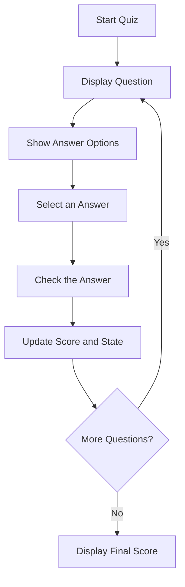

# 📝 Quiz Game

⚡ **Quiz Game** is a simple and interactive application built using **HTML5, CSS3, and JavaScript**.

It allows users to answer multiple-choice questions, track their scores, and view their final results. Questions and answer options are displayed dynamically based on user interactions.

This project demonstrates JavaScript fundamentals such as **objects, arrays, `forEach()`, DOM manipulation, state management, functions, and event handling**.

<p align="center">
  
  
  
</p>

---

## 🚀 Technologies Used

- HTML5
- CSS3
- JavaScript

---

## ⚙️ Key Features

- 📝 Multiple-choice questions
- 🎯 Interactive answer selection
- 🔄 Dynamic question updates
- 📊 Automatic score tracking
- ✅ Answer validation
- 🏆 Final score display
- 🎨 Interactive user interface

---

## 🧠 JavaScript Concepts Practiced

- Objects and Arrays
- `forEach()` for iterating through answer options
- Functions
- DOM Manipulation
- Event Handling using `addEventListener()`
- Conditional Statements
- State Management
- Array indexing and score calculation

---

## 📁 Project Structure

```text
Quiz-Game/
├── index.html
├── style.css
├── script.js
└── README.md
```

---

## 🔁 How It Works



---

## 🚀 How to Run

1. Clone the repository:

   ```bash
   git clone <your-github-repository-url>
   ```

2. Open the project folder.
3. Open `index.html` in your browser or use VS Code Live Server.

---

## 🔮 Future Improvements

- Add a countdown timer.
- Add difficulty levels.
- Include more questions and categories.
- Display correct answers after each question.
- Add a restart quiz option.
- Store high scores using LocalStorage.

---

## 🔗 Connect With Me

[GitHub](https://github.com/VarshaChintapatla) | [LinkedIn](https://www.linkedin.com/in/varsha-chintapatla-391428332/)

---

<p align="center">
  Made with ❤️ by <strong>Chintapatla Varsha</strong>
</p>
